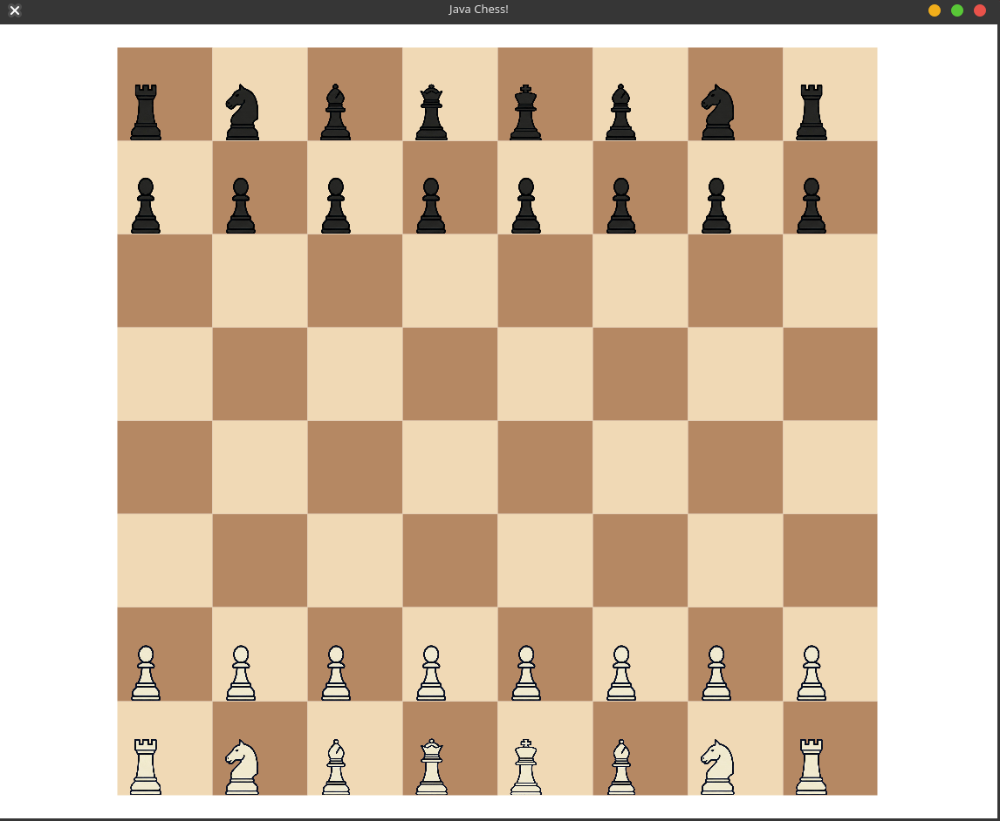
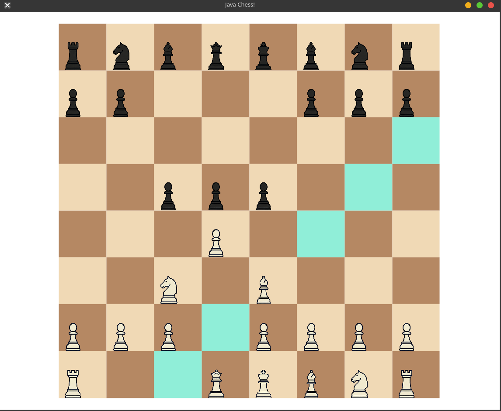

### A simple chess app built using java and javaFX, with stockfish engine opponent. The app is built using the Model-View-Controller (MVC) design pattern.

i'm using the stockfish API to get the best move for the opponent.

